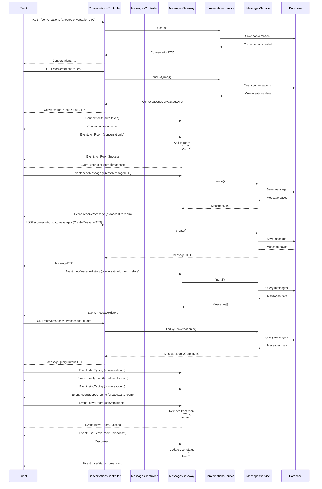
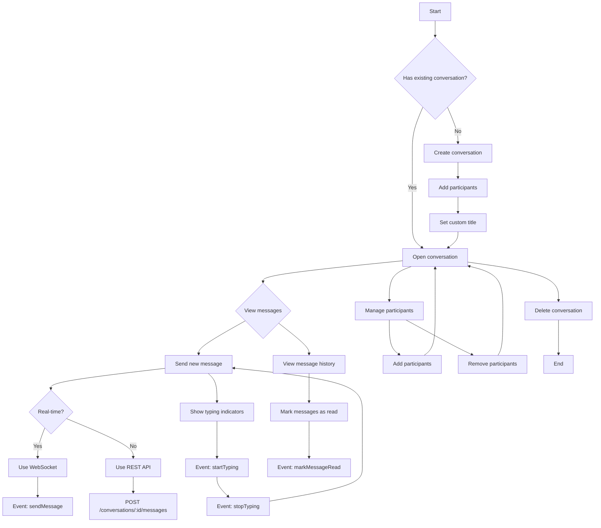

<!-- omit in toc -->
# Backend

<!-- omit in toc -->
## Table of contents

- [Getting started](#getting-started)
  - [Prerequisites](#prerequisites)
  - [Installation](#installation)
  - [Configuration](#configuration)
  - [Running the Application](#running-the-application)
  - [Basic Usage](#basic-usage)
- [Messaging System Architecture](#messaging-system-architecture)
  - [Message Flow Diagram](#message-flow-diagram)
  - [Conversation Management Flow](#conversation-management-flow)
- [Socket.IO Authentication Middleware](#socketio-authentication-middleware)
  - [Usage](#usage)
    - [Option 1: Auth Object (Recommended)](#option-1-auth-object-recommended)
    - [Option 2: Query Parameters](#option-2-query-parameters)
    - [Option 3: Authorization Header](#option-3-authorization-header)
  - [Error Handling](#error-handling)
- [Technologies](#technologies)

## Getting started

The backend of the **Junqo-platform** is a NestJs application.
Its main goal is to provide a REST API that enables efficient and flexible database interactions.

### Prerequisites

Before you begin, ensure you have the following software installed:

- [Node.js](https://nodejs.org/) (version 14.x or higher)
- [npm](https://www.npmjs.com/) (comes with Node.js)
- [PostgreSQL](https://www.postgresql.org/)

### Installation

1. Clone the repository:

    ```bash
    git clone https://github.com/Junqo-org/junqo-platform.git
    cd junqo-platform
    ```

2. Navigate to the backend directory:

    ```bash
    cd junqo_back
    ```

3. Install the dependencies:

    ```bash
    npm install
    ```

### Configuration

To configure the backend, you can use environment variables, `.env` files in the `junqo_back` directory or configuration files.
If an environment variable is not found, the default value will be used.

Here is the list of environment variables used by the **backend**:

- `DATABASE_HOST`: The host of the database. Default value is `localhost`.
- `DATABASE_PORT`: The port of the database. Default value is `5432`.
- `DATABASE_USER`: The user of the database. Default value is `junqo`.
- `DATABASE_NAME`: The name of the database. Default value is `junqo`.
- `DATABASE_PASSWORD`: The password of the database. Optional, if set, used in priority to `DATABASE_PASSWORD_FILE`.
- `DATABASE_PASSWORD_FILE`: The path to the file containing the password of the database user. Default value is `./../db_password.conf`.
- `JWT_SECRET`: The secret used to sign the JWT tokens. **Required**.
- `CORS_ORIGINS`: The URL of the frontend used for CORS. If not set accept requests from every origin.
- `OPENAI_API_KEY`: The API key used to access the OpenAI API. **Required**.
- `NODE_ENV`: The environment of the backend. Either `development` or `production`.

1. Create a `.env` file in the backend directory and add the following environment variables:

    ```env
    # Database Configuration
    # DATABASE_HOST=localhost
    # DATABASE_PORT=5432
    # DATABASE_NAME=your_db_name
    # DATABASE_USER=your_db_user
    # DATABASE_PASSWORD=your_db_password
    DATABASE_PASSWORD_FILE=/run/secrets/db_password

    # Security Configuration
    JWT_SECRET=not_for_production  # Use a strong, unique value in production
    # Minimum 32 characters, randomly generated
    # Example: openssl rand -base64 32
    # CORS Configuration (authorized source url). Default accept requests from every origin.
    # CORS_ORIGINS="http://localhost:80"
    # OPENAI_API_KEY='not_for_production'
    ```

2. Ensure PostgreSQL is running and the database is set up with the provided credentials.

### Running the Application

- To start the application in development mode:

  ```bash
  npm run start:dev
  ```

- To start the application in production mode:

  ```bash
  npm run start:prod
  ```

### Basic Usage

Once the application is running, you can access the API at `http://localhost:3000/api/v1`. For detailed API documentation, refer to the [API documentation](http://prod.junqo.fr:4200/api/v1).

## Messaging System Architecture

The messaging system in Junqo platform consists of two main components:\

- REST API endpoints for CRUD operations
- WebSocket connections for real-time interactions

### Message Flow Diagram



### Conversation Management Flow



## Socket.IO Authentication Middleware

### Usage

#### Option 1: Auth Object (Recommended)

```javascript
const socket = io('http://localhost:3000', {
  auth: {
    token: 'your-jwt-token-here'
  }
});
```

#### Option 2: Query Parameters

```javascript
const socket = io('http://localhost:3000', {
  query: {
    token: 'your-jwt-token-here'
  }
});
```

#### Option 3: Authorization Header

```javascript
const socket = io('http://localhost:3000', {
  extraHeaders: {
    'Authorization': 'Bearer your-jwt-token-here'
  }
});
```

### Error Handling

The middleware provides detailed error messages:

- `Authentication failed - token missing`: No token found in any location
- `Authentication failed - invalid token payload`: Token decoded but missing required fields
- `Authentication failed - invalid token`: Token verification failed (expired, malformed, etc.)

## Technologies

- [NestJs](https://nestjs.com/)
  - It is a progressive Node.js framework for building efficient, reliable, and scalable server-side applications.
- [PostgreSQL](https://www.postgresql.org/)
  - It is a powerful, open-source object-relational database system.
- [Sequelize](https://sequelize.org/)
  - It is a promise-based Node.js ORM for Postgres, MySQL, MariaDB, SQLite, and Microsoft SQL Server.
- [Express](https://expressjs.com/)
  - It is a fast, unopinionated, minimalist web framework for Node.js.
- [Socket.IO](https://socket.io/)
  - It is a library that enables real-time, bidirectional and event-based communication between the browser and the server.
