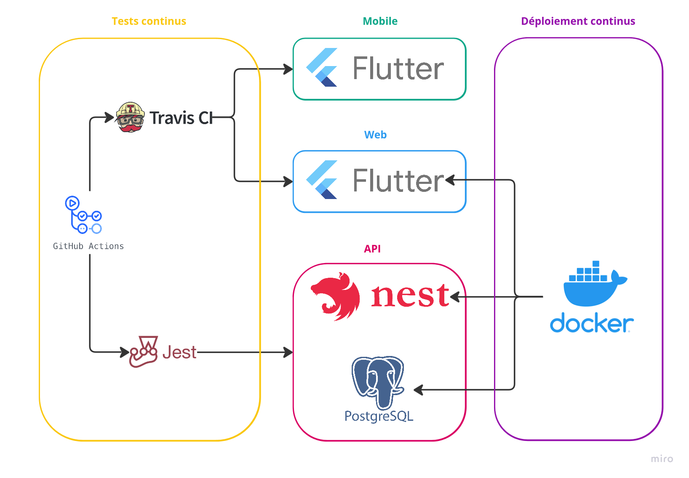

<!-- omit in toc -->
# Developer documentation

Welcome to the developer documentation of the **Junqo-platform**.  
This documentation is intended for developers who want to contribute to the project.  
  
If you are a new contributor, you should start by reading the [getting started](#getting-started) section.  
If you need some precise information, see the following sections :  

<!-- omit in toc -->
## Table of contents

- [Getting started](#getting-started)
  - [Before you begin](#before-you-begin)
  - [Prerequisites](#prerequisites)
  - [Installation](#installation)
  - [Usage](#usage)
- [Learn more](#learn-more)
  - [Project structure](#project-structure)
  - [Interactions](#interactions)
  - [Operation](#operation)
  - [Networking](#networking)
  - [API](#api)
  - [Documentation Generation](#documentation-generation)
  - [Technologies](#technologies)

## Getting started

### Before you begin

Before you begin, you should have a basic understanding of the following:

- Take a look at the [contributing guidelines](../../CONTRIBUTING.md) to understand how to contribute to the project.
- Take a look at the [code of conduct](../../CODE_OF_CONDUCT.md) to understand how to behave in the project.
- Take a look at the [project structure](#project-structure) to understand how the project is organized.

### Prerequisites

- [Git](https://git-scm.com/)
- [Docker](https://www.docker.com/) (v20.10.7 or higher)
- [Docker Compose](https://docs.docker.com/compose/) (v1.29.2 or higher)

### Installation

1. Clone the repository

    ```bash
    git clone git@github.com:Junqo-org/junqo-platform.git
    ```

2. Move to the project directory

    ```bash
    cd junqo-platform
    ```

3. Deploy the project locally using Docker Compose

    ```bash
    docker-compose up --build
    ```

### Usage

Notice, the following instructions are admitting that you are using the default configuration of the project.  
Furthermore, the project is running in production mode.  
You should replace *localhost* by the IP address of the machine running the project.  

- Access the web server at [http://localhost:80](http://localhost:80) or [https://localhost:443](https://localhost:443) if using TLS.
- Access the back server at [http://localhost:4200](http://localhost:4200).
- Access the database adminer at [http://localhost:3000](http://localhost:3000).

## Learn more

Notice, the following sections are admitting that you are using the default configuration of the project.

### Project structure

The project is structured as follows:

```bash
docker-compose.yml
├── /junqo_back
│   ├── Dockerfile
│   ├── Dockerfile.dev
│   ├── /src
│       ├── main.ts
├── /junqo_front
│   ├── Dockerfile
│   ├── Dockerfile.dev
│   ├── /lib
│       ├── main.dart
├── /docs
│   ├── developer_documentation/
│   ├── user_documentation/
│   ├── index.md
├── docker-compose.yml
├── docker-compose.dev.yml
```

> Project structure diagram

- `back`: Runs the Graphql API server to communicate with the database.
- `front`: Runs the web server / Flutter app seen by the user.
- `docs`: Contains the documentation of the project.
- `docker-compose.yml`: The main file to deploy the project in production mode.
- `docker-compose.dev.yml`: The main file to deploy the project in development mode.

### Interactions

The following diagram shows the interactions between the different parts of the project:  


> Interactions diagram

The **front** communicates with the back using the Graphql API.  
The **back** communicates with the database using the database driver.  
The **database** stores the data.  

### Operation

The following diagram shows how the different programs are executed:  



> Operational diagram

### Networking

The following diagram shows the networking of the project:  

```txt
External ports:   80/443              4200                5432                 3000
                     |                  |                   |                    |
               +-----------+       +----------+       +------------+       +-----------+
               |   Front   |       |   Back   |       |  DataBase  |       |  Adminer  |
               +-----------+       +----------+       +------------+       +-----------+
```

> Networking diagram

The **front** is accessible on the World Wide Web at port **80**/**443**.
The **back** is accessible on the World Wide Web at port **4200**.
The **database** is accessible on the World Wide Web at port **5432** (admitting that you are using Postgresql).
The **adminer** is accessible on the World Wide Web at port **3000**.

### API

The **backend** API uses **GraphQL** to communicate with the **frontend**.  
A schema is available at [/schemas/schema.graphql](../../schemas/schema.graphql).
Yous can find the API documentation at [http://doc.junqo.fr/api/index.html](../api/index.html).

### Documentation Generation

The project uses **Magidoc** to generate the backend API documentation.  
The documentation is available at [http://doc.junqo.org/api/index.html](../api/index.html).  
The documentation is generated automatically when the project is deployed using Github Action.  

If you want to generate the documentation manually, you can use the following command:

```bash
npx @magidoc/cli@latest generate
```

The rest of the documentation is written in Markdown and is available in the [docs](../../docs) directory.
It is automatically generated into a static website using Jekyll and is deployed using Github Pages.
The documentation is available at [http://doc.junqo.org/developer/index.html](../developer/index.html).

Install the dependencies by running the following command:

```bash
bundle install
```

Update the `Gemfile.lock` file by running the following command:

```bash
bundle update
```

To generate the documentation, run the following command:

```bash
bundle exec jekyll build
```

To serve the documentation locally, run the following command:

```bash
bundle exec jekyll serve --baseurl=""
```

For more information, see the [the official github page documentation](https://docs.github.com/en/pages/setting-up-a-github-pages-site-with-jekyll/testing-your-github-pages-site-locally-with-jekyll#building-your-site-locally).

### Technologies

The project uses the following technologies:

- Overall
  - [GitHub](https://github.com)
  - [Markdown](https://daringfireball.net/projects/markdown)
  - [Discord](https://discord.com/)
  - [Github Projects](https://docs.github.com/en/issues/planning-and-tracking-with-projects/learning-about-projects/about-projects)
- Documentation
  - [Markdown](https://daringfireball.net/projects/markdown)
  - [Jekyll](https://jekyllrb.com/)
  - [Magidoc](https://magidoc.github.io/)
  - [GitHub Pages](https://pages.github.com)
- CI/CD
  - [GitHub Actions](https://docs.github.com/en/actions)
- Frontend
  - [Flutter](https://flutter.dev/)
  - [Ferry Graphql](https://ferrygraphql.com/)
- Backend
  - [NestJs](https://nestjs.com/)
  - [PostgreSQL](https://www.postgresql.org/)
  - [Sequelize](https://sequelize.org/)
  - [Apollo Server](https://www.apollographql.com/docs/apollo-server/)
- Operations
  - [Docker Compose](https://docs.docker.com/compose/)
  - [Docker Swarm](https://docs.docker.com/engine/swarm/)
  - [Kubernetes](https://kubernetes.io/docs/home/)
  - [Helm](https://helm.sh/)
  - [MochaJs](https://mochajs.org/)
  - [Prometheus](https://prometheus.io/docs/introduction/overview/)
  - [Grafana](https://grafana.com/docs/grafana/latest/getting-started/getting-started-prometheus/)
