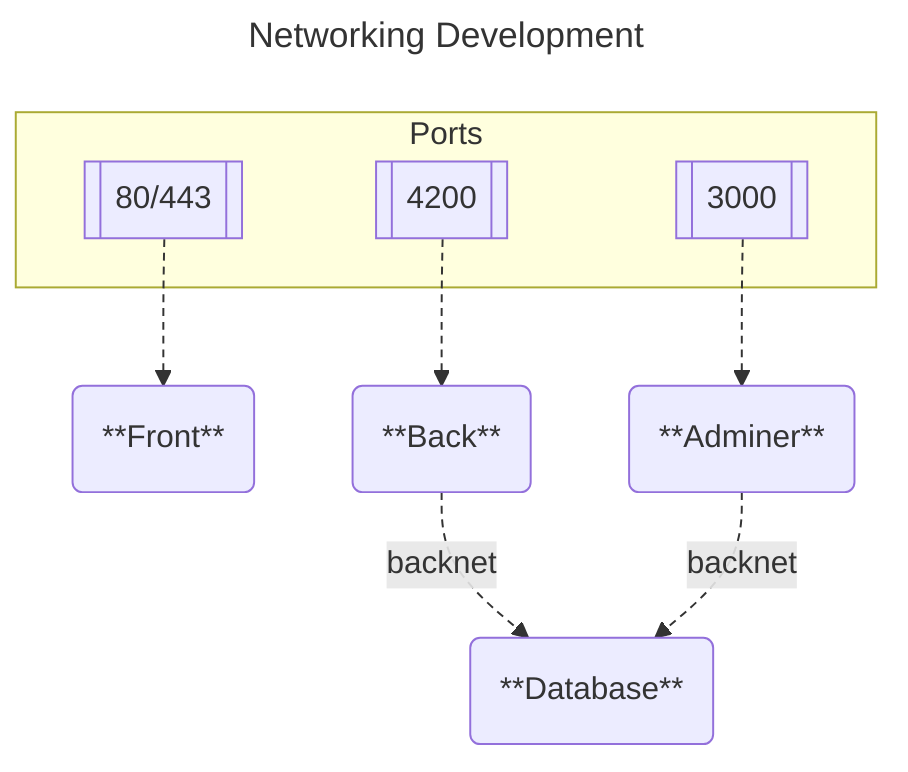
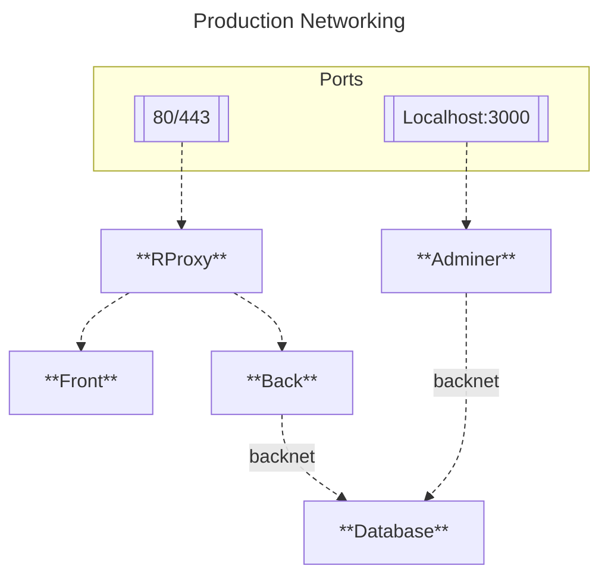
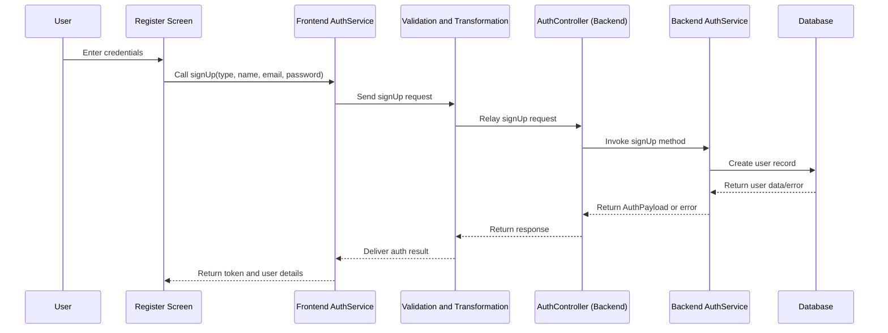
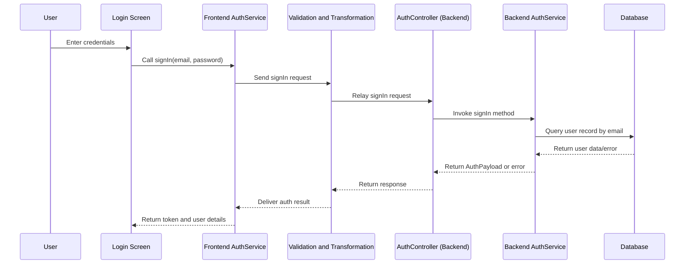
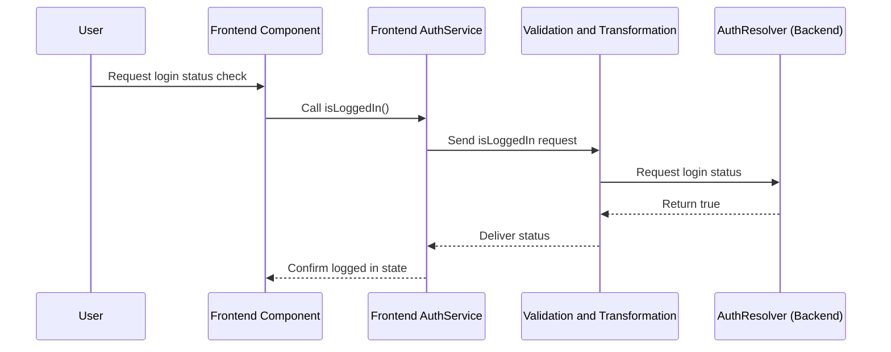

<!-- omit in toc -->
# Developer documentation

Welcome to the developer documentation of the **Junqo-platform**.
This documentation is intended for developers who want to contribute to the project.

If you are a new contributor, you should start by reading the [getting started](#getting-started) section.
If you need some precise information, see the following sections :

<!-- omit in toc -->
## Table of contents

- [Getting started](#getting-started)
  - [Before you begin](#before-you-begin)
  - [Prerequisites](#prerequisites)
  - [Testing the project](#testing-the-project)
  - [Deploying the project](#deploying-the-project)
- [Learn more](#learn-more)
  - [Project structure](#project-structure)
  - [Interactions](#interactions)
  - [Operation](#operation)
  - [Networking](#networking)
    - [Development](#development)
    - [Production](#production)
  - [API](#api)
  - [Sequence Diagram](#sequence-diagram)
    - [User SignUp](#user-signup)
    - [User SignIn](#user-signin)
    - [User login status check](#user-login-status-check)
  - [CI/CD](#cicd)
  - [Technologies](#technologies)

## Getting started

### Before you begin

Before you begin, you should have a basic understanding of the following:

- Take a look at the [contributing guidelines](../../CONTRIBUTING.md) to understand how to contribute to the project.
- Take a look at the [code of conduct](../../CODE_OF_CONDUCT.md) to understand how to behave in the project.
- Take a look at the [project structure](#project-structure) to understand how the project is organized.

### Prerequisites

- [Git](https://git-scm.com/)
- [Docker](https://www.docker.com/) (v20.10.7 or higher)
- [Docker Compose](https://docs.docker.com/compose/) (v1.29.2 or higher)

### Testing the project

To test the project locally, you can use the development environment provided by Docker Compose.
The deployment process is described in the [deployment documentation](./deployment.md#development-deployment).

### Deploying the project

To deploy the project in production, you can use the production environment provided by Docker Compose.
The deployment process is described in the [deployment documentation](./deployment.md#production-deployment).

## Learn more

The documentation below provides more in-depth information about the project.

- [Deployment](./deployment.md)
- [Frontend](./frontend.md)
- [Backend](./backend.md)
- [CI/CD](./ci_cd.md)
- [Logging Setup](./logging_setup.md)

### Project structure

The project is structured as follows:

```bash
├── /junqo_back
│   ├── dockerfile.prod
│   ├── dockerfile.dev
│   ├── /src
│       ├── main.ts
├── /junqo_front
│   ├── dockerfile.prod
│   ├── dockerfile.dev
│   ├── /lib
│       ├── main.dart
├── /docs
│   ├── developer_documentation/
│   ├── user_documentation/
│   ├── index.md
├── docker-compose.yaml
├── docker-compose.dev.yaml
```

> Project structure diagram

- `back`: Runs the REST API server to communicate with the database.
- `front`: Runs the web server / Flutter app seen by the user.
- `docs`: Contains the documentation of the project.
- `docker-compose.yaml`: The main file to deploy the project in production mode.
- `docker-compose.dev.yaml`: The main file to deploy the project in development mode.
- `tools`: Contains utility scripts to manage the project.

### Interactions

Notice, the following sections are admitting that you are using the default configuration of the project.

The following diagram shows the interactions between the different parts of the project:


> Interactions diagram

The **front** communicates with the back using the REST API.
The **back** communicates with the database using the database driver.
The **database** stores the data.

### Operation

The following diagram shows how the different programs are executed:


> Operational diagram

### Networking

Notice, the following sections are admitting that you are using the default configuration of the project.

The following diagram shows the networking of the project:

#### Development

```txt
Development
External ports:   80/443              4200                                         3000
                     |                  |                     db                     |
               +-----------+       +----------+ backnet +------------+ backnet +-----------+
               |   Front   |       |   Back   |---------|  Database  |---------|  Adminer  |
               +-----------+       +----------+         +------------+         +-----------+
```



> Networking diagram

The **front** is accessible on the World Wide Web at port **80**/**443**
The **back** is accessible on the World Wide Web at port **4200**
The **database** is using the **backnet** network for internal communication and so is not directly accessible from the outside.  
The **adminer** is accessible on the World Wide Web at port **3000** and communicates with the **database** through the **backnet** network.  

#### Production

```txt
Production
External ports:     80/443                          Localhost:3000
                      |                                   |
               +------------+                             |
               |   RProxy   |                             |
               +------------+                             |
                      |                                   |
                      |-------------------+               |
                      |                   |               |
                +----------+       +------------+         |
                |   Back   |       |    Front   |         |
                +----------+       +------------+         |
                      |                                   |
                      |                                   |
                +------------+                      +------------+
                |  Database  |----------------------|   Adminer  |
                +------------+                      +------------+
```



> Networking diagram

The **RProxy** (reverse proxy) is accessible on the World Wide Web at port **80**/**443** and forwards requests to the appropriate frontend or backend service.  
The **front** gets requests from the **RProxy**, requests to the back pass through **RProxy**.  
The **back** gets requests from the **RProxy** and communicates with the **database** through the **backnet** network.  
The **database** is using the **backnet** network for internal communication and so is not directly accessible from the outside.  
The **adminer** is accessible on **localhost:3000** and communicates with the **database** through the **backnet** network. If on a remote server, you would need to set up an SSH tunnel to access it.

### API

The **backend** API communicate with the **frontend**.
You can find the API documentation at [https://junqo.fr/api/v1](https://junqo.fr/api/v1).

### Sequence Diagram

The following diagram shows the sequence of the project:

#### User SignUp



#### User SignIn



#### User login status check



### CI/CD

For the continuous integration and continuous deployment, the project uses **Github Actions** and **Docker Compose**.
The CI/CD pipeline is defined in the [.github/workflows](../../.github/workflows) directory.

You can find the CI/CD documentation [here](ci_cd.md).

### Technologies

The project uses the following technologies:

- Overall
  - [GitHub](https://github.com)
  - [Markdown](https://daringfireball.net/projects/markdown)
  - [Discord](https://discord.com/)
  - [Github Projects](https://docs.github.com/en/issues/planning-and-tracking-with-projects/learning-about-projects/about-projects)
- Documentation
  - [Markdown](https://daringfireball.net/projects/markdown)
  - [Jekyll](https://jekyllrb.com/)
  - [GitHub Pages](https://pages.github.com)
  - [Swagger](https://swagger.io/)
- CI/CD
  - [GitHub Actions](https://docs.github.com/en/actions)
- Frontend
  - [Flutter](https://flutter.dev/)
  - [Dio](https://pub.dev/packages/dio)
- Backend
  - [NestJs](https://nestjs.com/)
  - [PostgreSQL](https://www.postgresql.org/)
  - [Sequelize](https://sequelize.org/)
- Operations
  - [Docker Compose](https://docs.docker.com/compose/)
  - [Docker Swarm](https://docs.docker.com/engine/swarm/)
  - [Kubernetes](https://kubernetes.io/docs/home/)
  - [Helm](https://helm.sh/)
  - [MochaJs](https://mochajs.org/)
  - [Prometheus](https://prometheus.io/docs/introduction/overview/)
  - [Grafana](https://grafana.com/docs/grafana/latest/getting-started/getting-started-prometheus/)
