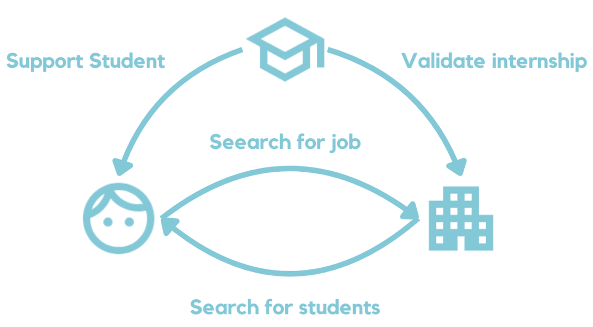

<!-- omit in toc -->
# User documentation

Welcome to the user documentation of the **Junqo-platform** project.  
This documentation is intended for users who want to use the project.

<!-- omit in toc -->
## Table of contents

- [Presentation of the project](#presentation-of-the-project)
- [Getting started](#getting-started)
  - [User roles](#user-roles)
  - [User flow](#user-flow)
  - [Student](#student)
  - [Company](#company)
  - [School](#school)

## Presentation of the project

Junqo is a solution designed to help young people find internships and work-study programs.  

Three main problems can be identified: lack of follow-up, complexity of the search and lack of visibility.
Junqo aims to support young people throughout the search process. To this end, assistance based on AI models will be made available.
For example, an interview simulator will be available, as well as assistance with CV writing.  

Students aren't the only ones targeted. Junqo also targets small businesses struggling to find a place in the job market. Our business model and our policy of publishing internship offers give the 10-employee startup as much visibility as the multinational.  

As far as the search is concerned, an advanced algorithm will only suggest what really corresponds to you. Only the necessary information is displayed. The aim is to save time and simplify the process.  

In order to facilitate access to the platform for as many people as possible, Junqo is intended to be both a mobile application and a web platform.  

## Getting started

### User roles

Junqo has three main user roles:

- **Student**: A user looking for internships or work-study programs.
- **School**: An educational institution that wants to help its students find opportunities.
- **Company**: A business looking to hire interns or work-study students.

### User flow

1. First you need to create an account on the Junqo platform.
   During the registration process, you will be asked your role between "**student**", "**school**" and "**company**".
   Please choose the role that best describes you in order to provide a personalized experience.
2. Once your account is created, you can start exploring the platform and its features.
3. Depending on your role, you will have access to different functionalities:
   - As a **student**, you can create and manage your profile, search for internships or work-study programs, apply for offers, and use AI tools to improve your applications.
   - As a **school**, you can manage your institution's profile, post internship offers, and assist your students in their search.
   - As a **company**, you can create and manage your company profile, post internship offers, and review applications from students.

### Student

As a student, you can create and manage your profile, search for internships or work-study programs, apply for offers, and use AI tools to improve your applications.

### Company

As a company, you can create and manage your company profile, post internship offers, and review applications from students.

### School

/!\ Not currently implemented
As a school, you can manage your institution's profile, post internship offers, and assist your students in their search.
